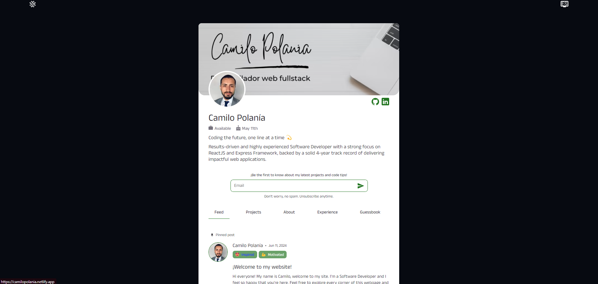

# 🌐 Fullstack Personal Developer Portfolio

### 👨‍🦰Camilo Polanía☝️

Welcome to my web Fullstack Developer Portfolio! This project showcases my skills and expertise in building responsive, user-friendly web applications using ReactJS, SASS, NodeJS and a lot of technologies thats makes this proyect amazing!.



## 🚀 Project Overview

This portfolio is a comprehensive showcase of my work as a Fullstack Developer. It includes examples of my projects, skills and contact information, providing a clear representation of my capabilities and professional experience.

## 🎨 Features

- **Modern UI/UX Design**: A clean and intuitive design built with ReactJS.
- **Responsive Layout**: Fully responsive, ensuring a seamless experience across all devices.
- **Fast Performance**: Leveraging Vite for a lightning-fast development and build process.
- **Modular CSS**: Styles managed with SASS for better modularity and maintainability.
- **Interactive Components**: Engaging UI components to demonstrate functionality.
- **Real-time updates**: Real-time event system developed with socket technology

## 🛠️ Technologies Used

- **Frontend**:

  - [ReactJS](https://reactjs.org/)
  - [SASS](https://sass-lang.com/)
  - [Vite](https://vitejs.dev/)
  - [TypeScript](https://www.typescriptlang.org/)

## 📸 Screenshots


## 📚 Getting Started

### Prerequisites

Make sure you have [Node.js](https://nodejs.org/) installed on your machine.

### Installation

1. Clone the repository:
   ```bash
   git clone https://github.com/camiloop96/portfolio-client.git
   cd portfolio
   ```
2. Install dependencies:

```bash
npm install
```

3. Run the development server:

```bash
npm run dev
```

4. Open your browser and navigate to http://localhost:3000.

📬 Contact
Feel free to reach out if you have any questions or want to collaborate on a project!

- Email: cpolania96@outlook.com
- GitHub: [camiloop96](https://github.com/camiloop96)

🙌 Acknowledgements
Special thanks to the creators of React, Vite, SASS and all the wonderful tools used in this project.

📜 License
This project is licensed under the MIT License - see the LICENSE file for details.
